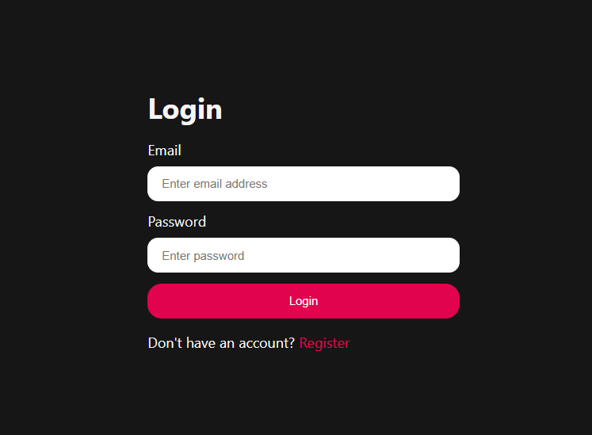
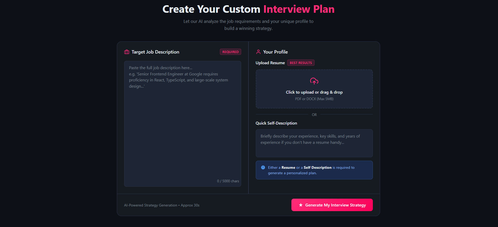
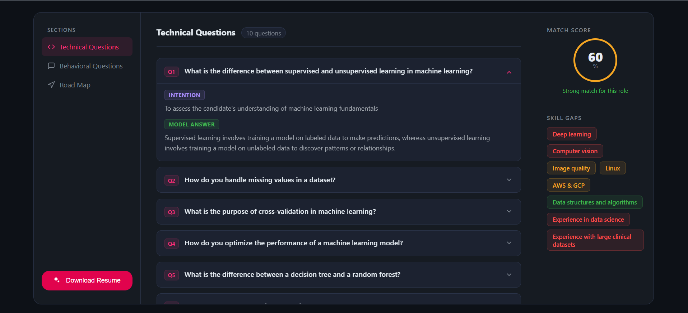
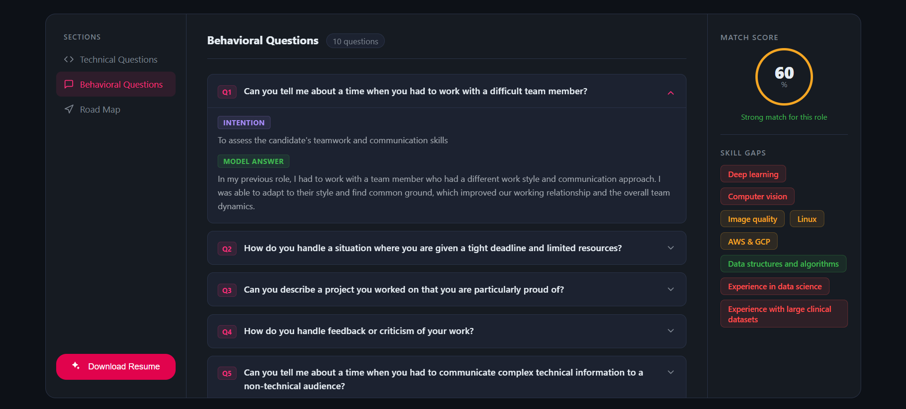
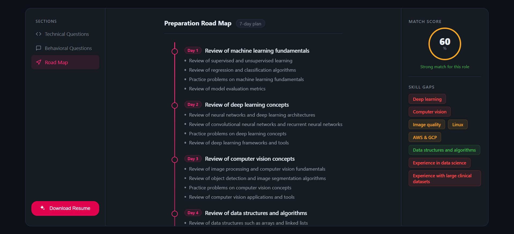
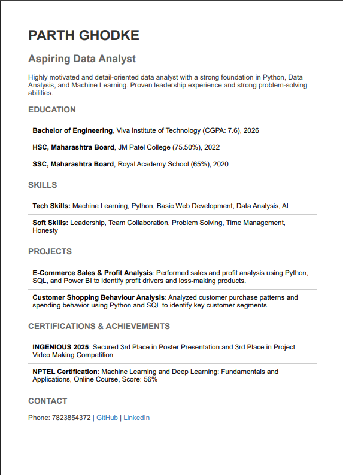

# 🚀 AI Resume & Interview Analyzer

An AI-powered Resume Analyzer & Interview Preparation Platform that helps job seekers evaluate their resumes against a Job Description using Large Language Models.

The application analyzes uploaded resumes, calculates an ATS Match Score, identifies missing skills, generates personalized interview questions, and creates a 7-day interview preparation roadmap.

---

## 📸 Screenshots

### Login


### Dashboard


### Technical Questions


### Behavioral Questions


### Preparation Plan


### AI Generated Interview Report


---
Live Demo : https://ai-resume-interview-analyzer-w8q5.vercel.app/
---

# ✨ Features

- 🔐 JWT Authentication
- 📄 Resume PDF Upload
- 📑 PDF Resume Parsing
- 🤖 AI Resume Analysis
- 📊 ATS Match Score
- 💼 Technical Interview Questions
- 👨‍💼 Behavioral Interview Questions
- 📉 Skill Gap Detection
- 📅 7-Day Preparation Plan
- 📄 AI Resume PDF Generation
- 💾 MongoDB Storage
- 📱 Responsive UI

---

# 🛠 Tech Stack

## Frontend

- React.js
- Vite
- Axios
- SCSS

## Backend

- Node.js
- Express.js
- MongoDB
- Mongoose
- JWT Authentication
- Multer
- PDF Parse
- Puppeteer

## AI

- Groq API
- Llama 3.3 70B Versatile

---

# 📂 Project Structure

```
AI-Resume-Interview-Analyzer
│
├── Backend
│   ├── config
│   ├── controllers
│   ├── middleware
│   ├── models
│   ├── routes
│   ├── services
│   └── server.js
│
├── Frontend
│   ├── src
│   ├── public
│   └── vite.config.js
│
├── Screenshots
│
└── README.md
```

---

# ⚡ Installation

## Clone Repository

```bash
git clone https://github.com/ParthGhodke/AI-Resume-Interview-Analyzer.git
```

Move into project

```bash
cd AI-Resume-Interview-Analyzer
```

---

## Backend Setup

```bash
cd Backend

npm install

npm run dev
```

---

## Frontend Setup

Open another terminal

```bash
cd Frontend

npm install

npm run dev
```

---

# 🔑 Environment Variables

Create a `.env` file inside **Backend**

```env
PORT=3000

MONGO_URI=your_mongodb_connection

JWT_SECRET=your_secret_key

GROQ_API_KEY=your_groq_api_key
```

---

# 🤖 AI Features

The application uses **Groq Llama 3.3 70B** to generate

- Resume Analysis
- ATS Match Score
- Technical Interview Questions
- Behavioral Interview Questions
- Skill Gap Analysis
- Personalized Preparation Plan
- ATS Friendly Resume

---

# 📌 Workflow

```
Resume PDF
      │
      ▼
PDF Parsing
      │
      ▼
Groq AI Analysis
      │
      ▼
Interview Report
      │
      ├── Match Score
      ├── Skill Gaps
      ├── Technical Questions
      ├── Behavioral Questions
      └── Preparation Plan
```

---

# 🎯 Future Improvements

- 🎙 AI Voice Mock Interviews
- 📹 Video Interview Analysis
- 🧠 Company Specific Interview Questions
- 📈 Resume Improvement Suggestions
- 🔗 LinkedIn Profile Analysis
- 🌐 Live Deployment
- 📊 Analytics Dashboard

---

# 💡 Challenges Solved

- Migrated from **Gemini API** to **Groq API** after Gemini model deprecation.
- Implemented secure JWT authentication with token blacklisting.
- Built PDF parsing and AI-powered resume analysis.
- Generated structured JSON responses using Groq LLM.
- Created ATS-friendly resume PDF generation.

---

# 👨‍💻 Author

**Parth Ghodke**

Computer Engineering (AI & ML)

📧 Email: parthace009@gmail.com

🔗 LinkedIn: www.linkedin.com/in/parth-ghodke-4051102a0

💻 GitHub: https://github.com/ParthGhodke

---

# ⭐ If you like this project

Give it a ⭐ on GitHub!
